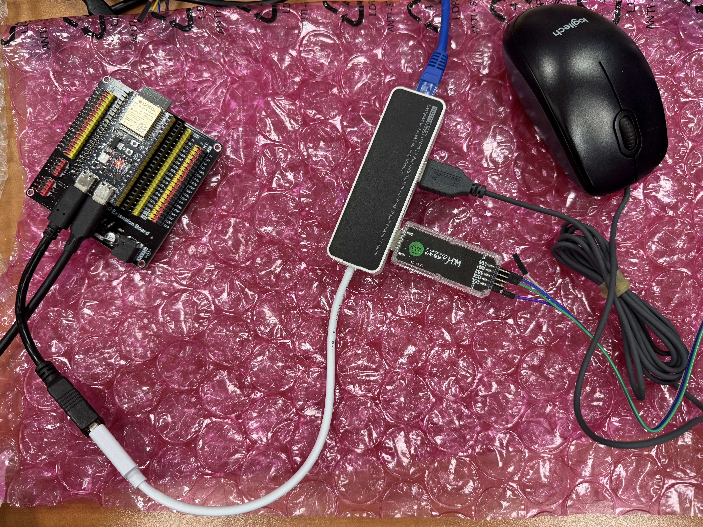
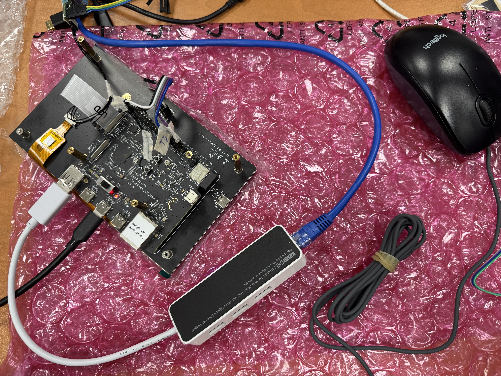

# ESP32-S3/P4 Porting USB Host Stack with multiple classes


### 1. Require Hardware & SDK version

Hardware: 
[ESP32-S3-DevKit-C](https://docs.espressif.com/projects/esp-dev-kits/en/latest/esp32s3/esp32-s3-devkitc-1/index.html) |
[ESP32-P4X-FunctionEV](https://docs.espressif.com/projects/esp-dev-kits/en/latest/esp32p4/esp32-p4x-function-ev-board/index.html)

The ESP32-S3-DevKit-C can't supply power to downstream usb devices on its usb port at default.

Try remove D1 and short it on the board, but beware of the voltage level that provide to usb devices.

SDK Version: Tested on ESP-IDF v6.1.0/v5.5.5

Using following dependency, already exist in idf_components.yml file.
```
  espressif/usb_host_hid: '*'
  espressif/usb_host_msc: '*'
  espressif/iperf: '*'
  espressif/iperf-cmd: '*'
```

### 2. SDKConfig

For ESP32-S3, please enable following settings in sdkconfig.

```
idf.py menuconfig 
```

```Settings
LWIP
 |---Enable IP Forwarding
 |---Enable NAT
 |---Enable NAT Port Mapping

USB OTG
 |---Support Hubs
 |---Support multiple Hubs #not necessary
 |---Enable enumeration filter callback #If ECM is used, this must be enabled

FreeRTOS
 |---configTick_RATE_Hz 
     set to 1000Hz might increase speed

```

Other settings that might increase speed: lwip IRAM optimize/ FreeRTOS only work on 1st core

Do not increase lwip mailbox or related settings, increase these things might decrease speed.

For ESP32-P4, please eanble following settings in sdkconfig.

```Settings
USB OTG
 |---Support Hubs
 |---Support multiple Hubs #not necessary
 |---Enable enumeration filter callback #If ECM is used, this must be enabled

```

There is also a example Kconfig.projbuild file, you can choose specific supported usb classes.

Currently, only following 4 usb classes is supported.

```
USB HID
USB MSC
USB CDC ACM
USB CDC ECM
```

### 3. Limitation on ESP32-P4

The USB phy on ESP32P4 did not support split transaction, which means it can't support high speed to full/low speed transaction with a hub connected.


```
ESP32P4 
   |____HUB
         |____FS or LS Device  # not supported
        
```

```
ESP32P4 -> HS/FS/LS speed all supported
```

Even though ESP32P4 owns 16 endpoints on USB high speed port, but only high speed devices are supported.

### 4. Limitation on ESP32-S3

Due to limited endpoints on ESP32-S3, only HID class cant support more devices when connecting to a hub.

Please be noticed that when ESP32-S3 acting as a USB host, there is only 8 endpoints.

If using a hub device, it consumes 2 endpoints. 1 for EP0 & 1 for IN-EP

If using a HID device, it consumes 2 endpoints. 1 for EP0 & 1 for IN-EP

If using a CDC-ACM/ECM device, it consumes 4 endpoints. 1 for EP0 & 1 for IN-EP(interrupt type) 1 for BULK-IN 1 for BULK-OUT

You can only connect 1 hub and 1 cdc type usb device at the same time.

or

1 Hub + 3 HID(boot) devices.

### 5. iperf test on ESP32P4 through USB CDC ECM device

The speed test through iperf is amazing.

The RMII EMAC interface iperf test is nearly 60-66Mbps, 

```
esp> iperf -s -i 2 -t 30
I (102494) IPERF: mode=tcp-server sip=0.0.0.0:5001, dip=0.0.0.0:0, interval=2, time=30
I (102494) iperf(id=1): [TCP Server] Socket created
esp> [  1] local 192.168.0.100:5001 connected to 192.168.0.101:44640

[ ID] Interval          Transfer        Bandwidth
[  1]  0.0- 2.0 sec     13.23 MBytes    52.91 Mbits/sec
[  1]  2.0- 4.0 sec     13.00 MBytes    51.99 Mbits/sec
[  1]  4.0- 6.0 sec     13.16 MBytes    52.64 Mbits/sec
[  1]  6.0- 8.0 sec     12.88 MBytes    51.51 Mbits/sec
[  1]  8.0-10.0 sec     12.86 MBytes    51.45 Mbits/sec
[  1] 10.0-12.0 sec     12.83 MBytes    51.32 Mbits/sec
[  1] 12.0-14.0 sec     12.86 MBytes    51.43 Mbits/sec
[  1] 14.0-16.0 sec     13.32 MBytes    53.26 Mbits/sec
[  1] 16.0-18.0 sec     12.92 MBytes    51.68 Mbits/sec
[  1] 18.0-20.0 sec     13.21 MBytes    52.82 Mbits/sec
[  1] 20.0-22.0 sec     13.26 MBytes    53.05 Mbits/sec
[  1] 22.0-24.0 sec     12.88 MBytes    51.52 Mbits/sec
[  1] 24.0-26.0 sec     12.96 MBytes    51.83 Mbits/sec
[  1] 26.0-28.0 sec     13.21 MBytes    52.84 Mbits/sec
[  1] 28.0-30.0 sec     13.29 MBytes    53.16 Mbits/sec
[  1]  0.0-30.0 sec     195.86 MBytes   52.23 Mbits/sec
esp> 
esp> iperf -c 192.168.0.101 -p 5001 -i 2 -t 30
I (161564) IPERF: mode=tcp-client sip=0.0.0.0:0, dip=192.168.0.101:5001, interval=2, time=30
[  1] local 192.168.0.100:59436 connected to 192.168.0.101:5001

[ ID] Interval          Transfer        Bandwidth
esp> [  1]  0.0- 2.0 sec        12.60 MBytes    50.41 Mbits/sec
[  1]  2.0- 4.0 sec     12.22 MBytes    48.87 Mbits/sec
[  1]  4.0- 6.0 sec     12.11 MBytes    48.45 Mbits/sec
[  1]  6.0- 8.0 sec     12.12 MBytes    48.46 Mbits/sec
[  1]  8.0-10.0 sec     12.11 MBytes    48.45 Mbits/sec
[  1] 10.0-12.0 sec     12.13 MBytes    48.52 Mbits/sec
[  1] 12.0-14.0 sec     12.59 MBytes    50.38 Mbits/sec
[  1] 14.0-16.0 sec     12.54 MBytes    50.15 Mbits/sec
[  1] 16.0-18.0 sec     12.19 MBytes    48.75 Mbits/sec
[  1] 18.0-20.0 sec     12.62 MBytes    50.49 Mbits/sec
[  1] 20.0-22.0 sec     12.15 MBytes    48.59 Mbits/sec
[  1] 22.0-24.0 sec     12.54 MBytes    50.17 Mbits/sec
[  1] 24.0-26.0 sec     12.23 MBytes    48.91 Mbits/sec
[  1] 26.0-28.0 sec     12.61 MBytes    50.43 Mbits/sec
[  1] 28.0-30.0 sec     12.54 MBytes    50.16 Mbits/sec
[  1]  0.0-30.0 sec     185.30 MBytes   49.41 Mbits/sec
```

### 6. ESP32S3 iperf speed test on USB CDC ECM


```iperf
esp> iperf -s -i 2 -t 30
I (123635) IPERF: mode=tcp-server sip=0.0.0.0:5001, dip=0.0.0.0:0, interval=2, time=30
esp> I (123635) iperf(id=1): [TCP Server] Socket created
[  1] local 192.168.0.100:5001 connected to 192.168.0.101:34404

[ ID] Interval          Transfer        Bandwidth
[  1]  0.0- 2.0 sec     1.52 MBytes     6.08 Mbits/sec
[  1]  2.0- 4.0 sec     1.52 MBytes     6.08 Mbits/sec
[  1]  4.0- 6.0 sec     1.52 MBytes     6.09 Mbits/sec
[  1]  6.0- 8.0 sec     1.52 MBytes     6.09 Mbits/sec
[  1]  8.0-10.0 sec     1.50 MBytes     6.01 Mbits/sec
[  1] 10.0-12.0 sec     1.53 MBytes     6.11 Mbits/sec
[  1] 12.0-14.0 sec     1.52 MBytes     6.09 Mbits/sec
[  1] 14.0-16.0 sec     1.52 MBytes     6.10 Mbits/sec
[  1] 16.0-18.0 sec     1.53 MBytes     6.11 Mbits/sec
[  1] 18.0-20.0 sec     1.54 MBytes     6.16 Mbits/sec
[  1] 20.0-22.0 sec     1.52 MBytes     6.10 Mbits/sec
[  1] 22.0-24.0 sec     1.52 MBytes     6.07 Mbits/sec
[  1] 24.0-26.0 sec     1.53 MBytes     6.12 Mbits/sec
[  1] 26.0-28.0 sec     1.52 MBytes     6.08 Mbits/sec
[  1] 28.0-30.0 sec     1.52 MBytes     6.07 Mbits/sec
[  1]  0.0-30.0 sec     22.84 MBytes    6.09 Mbits/sec
i
Unrecognized command
esp> iperf -c 192.168.0.101 -p 5001 -i 2 -t 30
I (175295) IPERF: mode=tcp-client sip=0.0.0.0:0, dip=192.168.0.101:5001, interval=2, time=30
esp> [  1] local 192.168.0.100:50092 connected to 192.168.0.101:5001

[ ID] Interval          Transfer        Bandwidth
[  1]  0.0- 2.0 sec     1.70 MBytes     6.80 Mbits/sec
[  1]  2.0- 4.0 sec     1.89 MBytes     7.56 Mbits/sec
[  1]  4.0- 6.0 sec     1.91 MBytes     7.64 Mbits/sec
[  1]  6.0- 8.0 sec     1.86 MBytes     7.45 Mbits/sec
[  1]  8.0-10.0 sec     1.90 MBytes     7.58 Mbits/sec
[  1] 10.0-12.0 sec     1.87 MBytes     7.50 Mbits/sec
[  1] 12.0-14.0 sec     1.91 MBytes     7.65 Mbits/sec
[  1] 14.0-16.0 sec     1.88 MBytes     7.52 Mbits/sec
[  1] 16.0-18.0 sec     1.92 MBytes     7.66 Mbits/sec
[  1] 18.0-20.0 sec     1.88 MBytes     7.53 Mbits/sec
[  1] 20.0-22.0 sec     1.91 MBytes     7.65 Mbits/sec
[  1] 22.0-24.0 sec     1.88 MBytes     7.52 Mbits/sec
[  1] 24.0-26.0 sec     1.91 MBytes     7.63 Mbits/sec
[  1] 26.0-28.0 sec     1.92 MBytes     7.66 Mbits/sec
[  1] 28.0-30.0 sec     1.90 MBytes     7.60 Mbits/sec
[  1]  0.0-30.0 sec     28.24 MBytes    7.53 Mbits/sec
```

### 7. How to use

Open a terminal through UART0 on ESP32-S3/P4 and type usb to enable/disable usb host function.

```
esp>usb #type again to disable

```

### 8. Test:




Tested USB-ECM devices:
```
CH395
RTL8152b
```

Tested USB-ACM devices:
```
CH343
ST VirtualComm
```

Tested USB Hub:
```
FE1.1S
RTS5411T
```

EOF